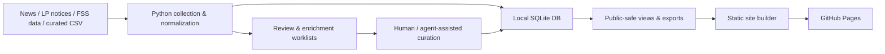

# Korea PEF Intelligence

> Korean private equity market intelligence service: daily deal brief, LP commitment monitor, and GP/market data room.

## Overview

Korea PEF Intelligence is a portfolio project that turns fragmented Korean private equity information into a structured, searchable static web service.

The service combines daily news clipping, LP commitment notice tracking, GP profile data, and market-monitoring workflows into one public-facing product. It is designed for investment professionals who need to quickly scan Korean PEF market activity without manually checking dozens of news and institutional websites.

**Live site:** [https://pkkong.github.io/kpef-newsletter/](https://pkkong.github.io/kpef-newsletter/)

## Product Highlights

- **Daily Brief**
  - Curated Korean PEF news brief
  - Article classification, publisher normalization, archive support
  - Mobile-first reading experience

- **LP Commitment Monitor**
  - Public LP / institutional allocator directory
  - Official commitment notice tracking
  - Notice status model for new notices, shortlist, selection result, closed mandates, and historical records

- **GP / Market Data Foundation**
  - GP master and profile data pipeline
  - FSS-based market statistics
  - News-driven GP update worklist for future enrichment

- **Static Public Delivery**
  - Generated HTML/CSS/JS
  - GitHub Pages deployment
  - Public pages are separated from raw data, local DB files, secrets, and operator workflows

## Why This Project

Korean PEF information is public but scattered:

- News articles are spread across financial media.
- LP notices are published on separate institutional pages.
- GP names often appear in inconsistent Korean/English aliases.
- Market data exists in regulatory files but is not shaped for quick product use.

This project explores how a small data product can collect, normalize, and publish that information as a lightweight intelligence service.

## System Architecture

## Operating Model

The public repository is a deployment mirror for the generated static website.

Sensitive or heavy local artifacts are not included:

- API keys and local environment files
- Raw crawled pages
- Local SQLite database
- Internal review queues
- Operator logs

The service is generated from a local/private data pipeline and published as static pages for public review.

## Tech Stack

| Layer | Tools |
| --- | --- |
| Data collection | Python, Naver News API, HTML/RSS parsing |
| Data model | SQLite, CSV-based maintained inputs |
| Site generation | Python static renderer |
| Frontend | HTML, CSS, vanilla JavaScript |
| Deployment | GitHub Pages |
| Operations | macOS launchd, build scripts, public smoke checks |

## Current Public Scope

The public demo currently focuses on:

- Daily PEF news brief
- LP directory and commitment notice pages
- Static public deployment workflow

GP/People enrichment and deeper market intelligence workflows are under active development in the source workspace.

## Design Direction

The UI is intentionally restrained and data-dense:

- Mobile-first layout
- Table-like directory rows for LP/GP data
- Flat article list for news
- Minimal color, thin dividers, consistent typography
- Public-facing wording only; internal review/status language is excluded

## Repository Note

This repository is optimized for portfolio review and public demo access. The generated files in this repository represent the public website output, not the full private collection environment.

For review, start here:

- [Live Demo](https://pkkong.github.io/kpef-newsletter/)
- [Daily Brief](https://pkkong.github.io/kpef-newsletter/daily-news.html)
- [LP Notices](https://pkkong.github.io/kpef-newsletter/lp-notices.html)

## Status

This is an active prototype. The core direction is to evolve it from a newsletter-style static site into a broader Korea PEF intelligence data room covering Brief, LP, GP, and market-monitoring workflows.
